  

I build the boring layer under AI agents: the part that records what they did, replays it, and
refuses to let them ship something broken. Chemist first, software second — the lab habit of
"write down every step or the result doesn't count" turned out to be the whole job.

Currently at **[@StuDocu](https://github.com/StuDocu)**, in the Netherlands.

---

### `● recording` — what's open right now

| span | what it is | stack |
|:--|:--|:--|
| **[samsara](https://github.com/Maher-Reven/samsara)** | Deterministic replay and fault injection for LLM agents. Record every effect an agent performs, replay it offline, fork it, and break it on purpose. | `Rust` `WebAssembly` |
| **[a11y-render-gate](https://github.com/Maher-Reven/a11y-render-gate)** | An accessibility gate *inside* the agent loop. Renders the UI an agent just wrote and reports contrast, focus visibility, hit targets and label wiring as computed facts with fixes attached — then blocks the turn until they're fixed. | `TypeScript` `Playwright` `MCP` |
| **[asdesigned](https://github.com/Maher-Reven/asdesigned)** · **[maher-portfolio](https://github.com/Maher-Reven/maher-portfolio)** | Design-to-code experiments and the current portfolio rebuild. | `TypeScript` |

Both agent projects come from the same complaint: an agent will happily tell you it succeeded.
Neither a replay log nor a contrast ratio is interested in what the agent claims.

---

### `effects` — upstream, most recent first

| | repo | what | status |
|:--|:--|:--|:--|
| `→` | **prettier/prettier** | [#20075](https://github.com/prettier/prettier/pull/20075) — unstable comment attachment on a parenthesized arrow body. Two handlers were fighting over the same comment, so formatting the same file twice gave two different files. | open |
| `→` | **expo/expo** | [#50215](https://github.com/expo/expo/pull/50215) — `Exception` dropped the description it was created with, so every `promise.reject(code, description)` reached JavaScript as `undefined reason`. | open |

Both were found the same way: reproduce it, then build a differential harness and let it tell you
how wide the bug actually is. The prettier one turned out to be 208 unstable cases, not 4.

---

### `instrumentation`

  

TypeScript pays the bills. Rust is where the systems work goes. The Swift and Dart at the bottom
of the bar are 2022 — see the archive.

---

### `replay` — the archive

Older spans, kept because deleting your own history is bad instrumentation:
[textToSpeach](https://github.com/Maher-Reven/textToSpeach) · [PhotoMania](https://github.com/Maher-Reven/PhotoMania) ·
[SwiftUI-weatherApp](https://github.com/Maher-Reven/SwiftUI-weatherApp) `Swift` —
[flutter_sub_reddit_app](https://github.com/Maher-Reven/flutter_sub_reddit_app) `Dart` —
[Expensify-APP](https://github.com/Maher-Reven/Expensify-APP) · [SocialApe](https://github.com/Maher-Reven/SocialApe) ·
[isomorphic-react](https://github.com/Maher-Reven/isomorphic-react) `React`

---

### `attach`

Language mix computed from the GitHub GraphQL API across 25 owned, non-fork repositories (2,375,272 bytes). Header and chart are hand-written SVG — no third-party stats service to rate-limit, expire, or quietly start serving someone else's numbers.
